# Documentaion of Project 3

STEP 1 – BACKEND CONFIGURATION

Update ubuntu with tht command below

`sudo apt update`

Screenshot Below

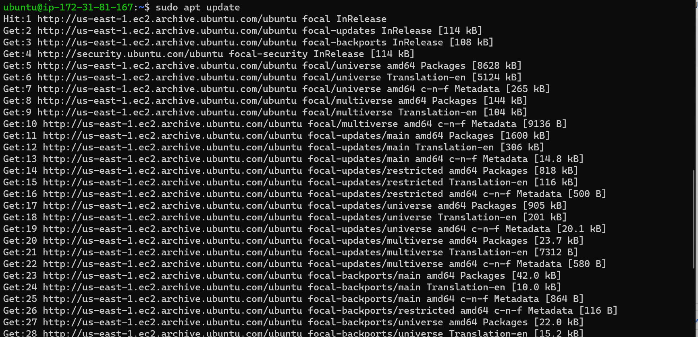

Upgrade ubuntu with the command below

`sudo apt upgrade`

Screenshot Below

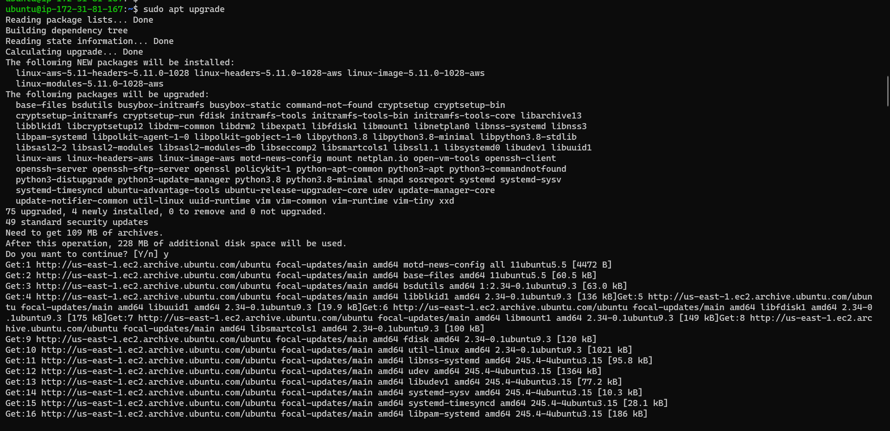

Getting the location of Node.js software from Ubuntu repositories using the command below

`curl -sL https://deb.nodesource.com/setup_12.x | sudo -E bash -`

Screenshot Below

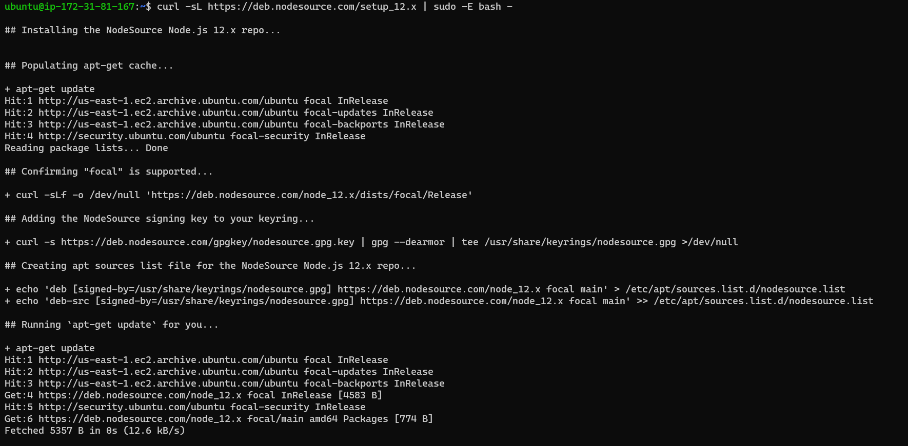

Install Node.js with the command below

`sudo apt-get install -y nodejs`

Screenshot Below

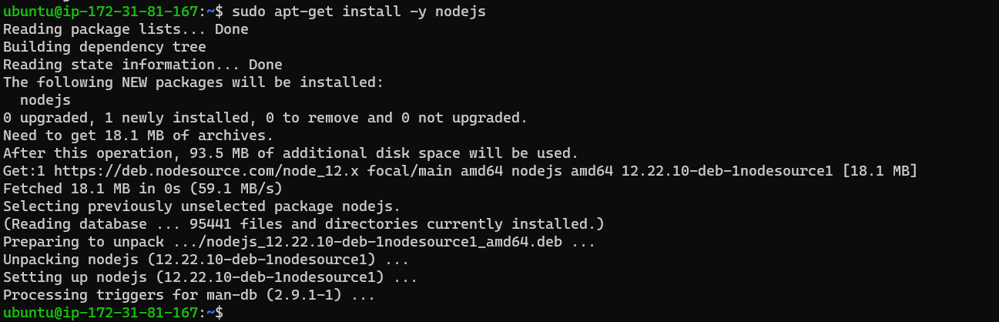

Verify the node installation with the command below

`node -v`

`npm -v`

Screenshot Below

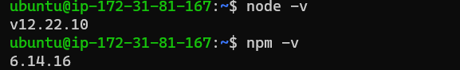

Created a new directory for your To-Do project:

`mkdir Todo`

Ran the command below to verify that the `Todo` directory is created with `ls` command

`ls`

Screenshot Below

Changed current directory to the newly created one:

`cd Todo`

Used the command npm init to initialise the project, so that a new file named package.json will be created.

`npm init`

Screenshot Below

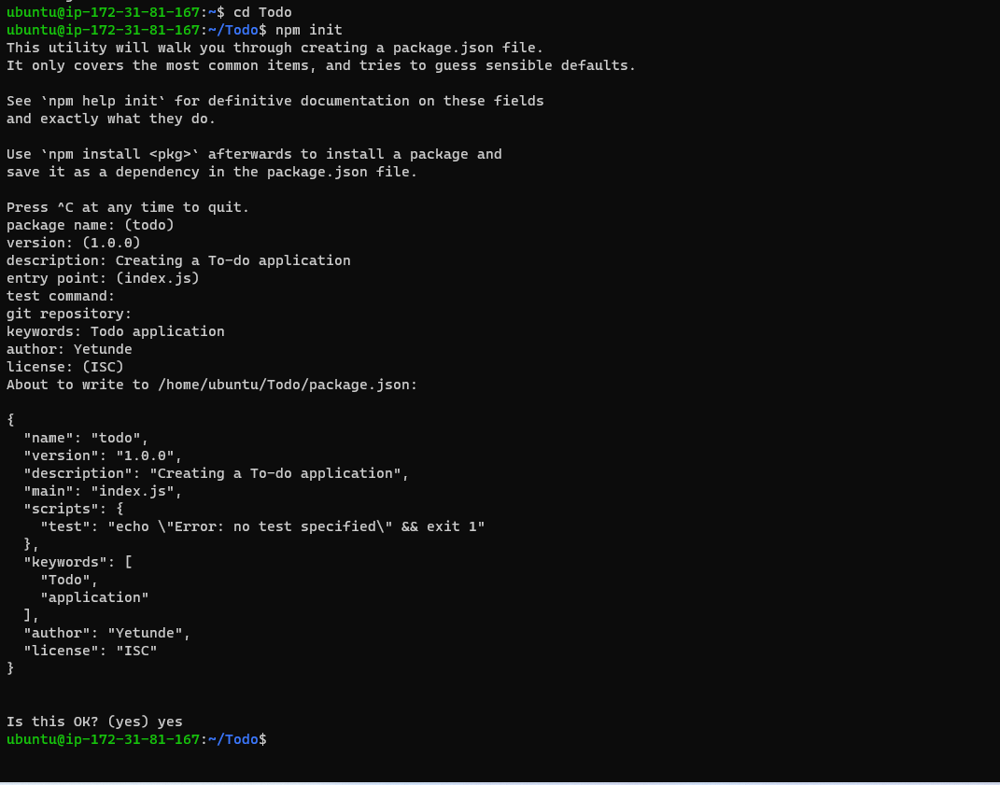

INSTALL EXPRESSJS

Install expressjs using the npm command below

`npm install express`

Created a file index.js with the command below

`touch index.js`

Ran ls to confirm that index.js file is successfully created

Install the dotenv module

`npm install dotenv`

Screenshot Below

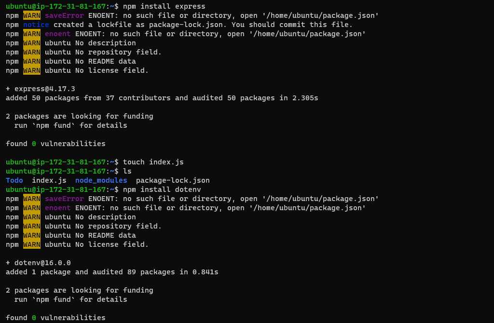

Open the index.js file with the command below

`vim index.js`

- Code pasted as shown in the screenshot below

`const express = require('express');
require('dotenv').config();

const app = express();

const port = process.env.PORT || 5000;

app.use((req, res, next) => {
res.header("Access-Control-Allow-Origin", "\*");
res.header("Access-Control-Allow-Headers", "Origin, X-Requested-With, Content-Type, Accept");
next();
});

app.use((req, res, next) => {
res.send('Welcome to Express');
});

app.listen(port, () => {
console.log(`Server running on port ${port}`)
});`

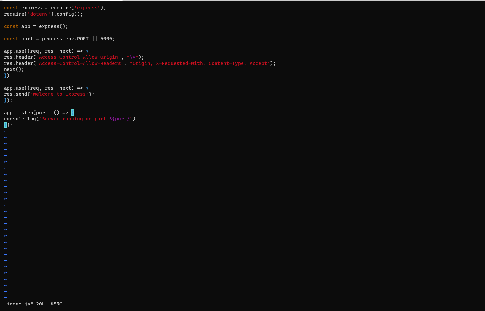

Saved then exited

Opened terminal in the same directory as  index.js file and typed:

`node index.js`

Screenshot Below

Open port 5000 in EC2 Security Groups; create an inbound rule to open TCP port 5000

Screenshot Below

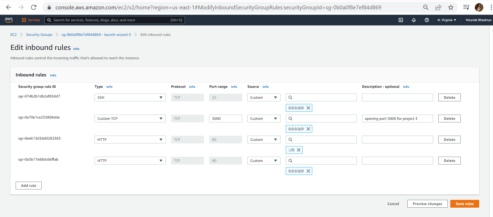

Opened browser and tried to access the server’s Public IP by port 5000: http://54.204.212.152:5000

Screenshot Below

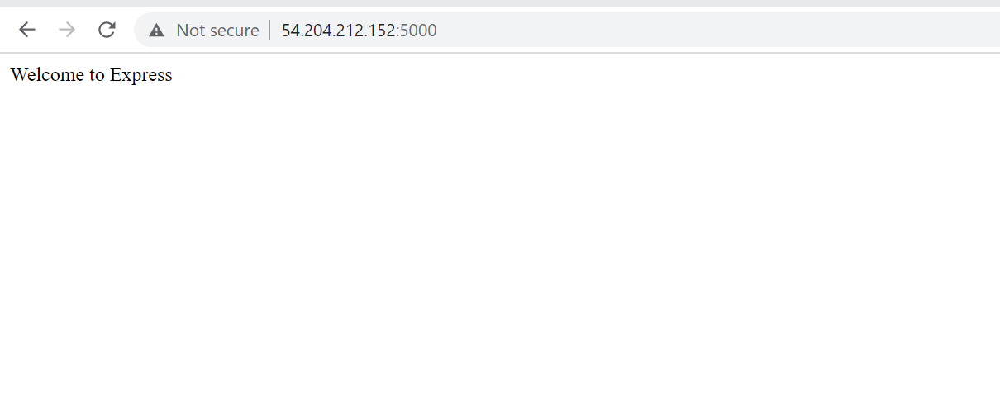

Routes

- Create a new task; POST

- Display list of all tasks; GET

- Delete a completed task; DELETE

For each task, routes were created that will define various endpoints that the To-do app will depend on. 

- Create folder routes using the command below

`mkdir routes`

- Change directory to routes folder with the command below.

`cd routes`

- Created a file api.js with the command below

`touch api.js`

See screensot below

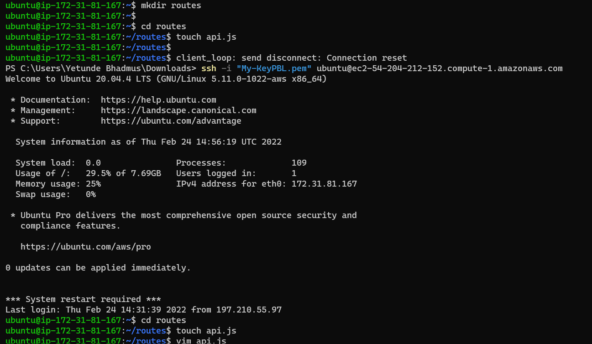

- Opened the file with the command below 

`vim api.js`

Typed the code in the screenshot below

`const express = require ('express');
const router = express.Router();

router.get('/todos', (req, res, next) => {

});

router.post('/todos', (req, res, next) => {

});

router.delete('/todos/:id', (req, res, next) => {

})

module.exports = router;`

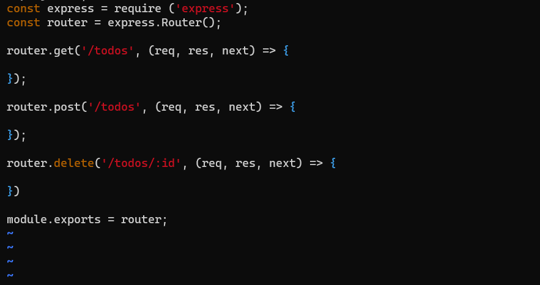

Created a Schema and a model by installing mongoose which is a Node.js package that makes working with mongodb easier.

- Changed directory back Todo folder and installed Mongoose with the command below

`npm install mongoose`

Screenshot Below
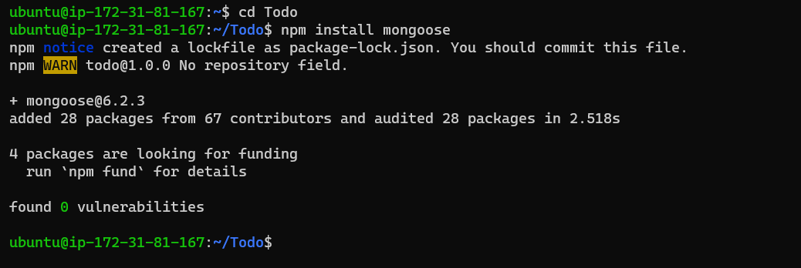
- Created a new folder models, 

- Changed directory into the newly created ‘models’ folder 

- Inside the models folder, created a file and name it todo.js
 
All three commands above can be defined in one line to be executed consequently with help of && operator

`mkdir models && cd models && touch todo.js` 

Screenshot below

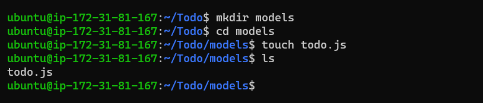

Opened the file created with `vim todo.js` then paste the code below in the file

`const mongoose = require('mongoose');
const Schema = mongoose.Schema;

//create schema for todo
const TodoSchema = new Schema({
action: {
type: String,
required: [true, 'The todo text field is required']
}
})

//create model for todo
const Todo = mongoose.model('todo', TodoSchema);

module.exports = Todo;`

Screenshot Below
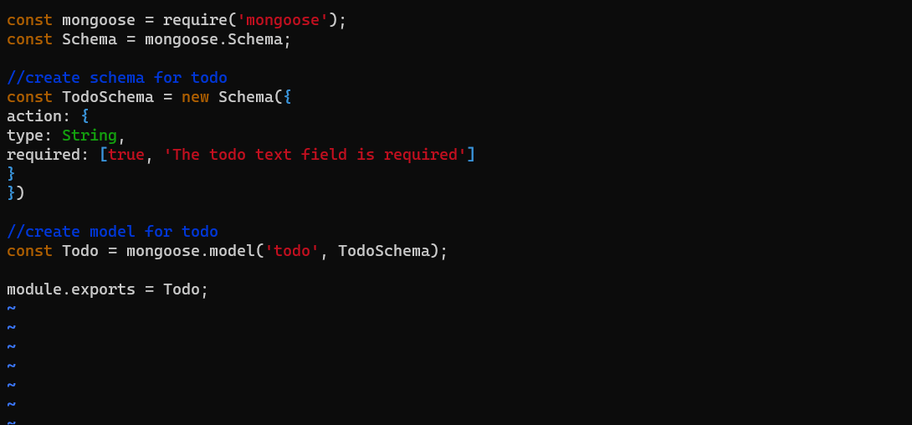

Updated routes from the file api.js in ‘routes’ directory to make use of the new model.

- In Routes directory, open api.js with vim api.js, delete the code inside with :%d command and paste there code below into it then save and exit

const express = require ('express');
const router = express.Router();
const Todo = require('../models/todo');

router.get('/todos', (req, res, next) => {

//this will return all the data, exposing only the id and action field to the client
Todo.find({}, 'action')
.then(data => res.json(data))
.catch(next)
});

router.post('/todos', (req, res, next) => {
if(req.body.action){
Todo.create(req.body)
.then(data => res.json(data))
.catch(next)
}else {
res.json({
error: "The input field is empty"
})
}
});

router.delete('/todos/:id', (req, res, next) => {
Todo.findOneAndDelete({"_id": req.params.id})
.then(data => res.json(data))
.catch(next)
})

module.exports = router;

Screenshot Below

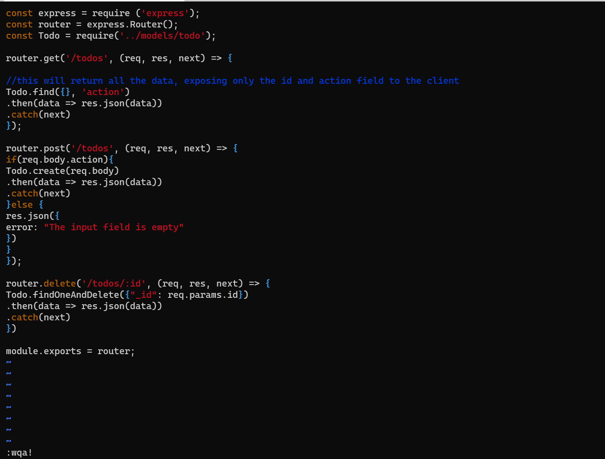

Created a MongoDB database and collection inside mLab

Created a file in  Todo directory and name it .env. using the command below

`touch .env`
`vi .env`

